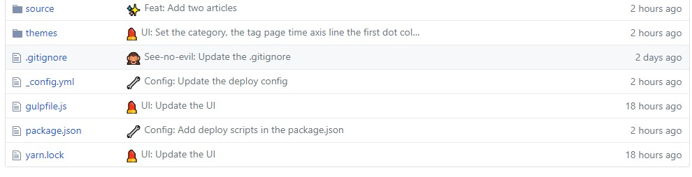

# 如何写出规范的 commit

> 当然是使用规范 + 工具进行行为的统一与约束。

## 写在前面

关于 Git，大家想必都很熟悉，因为我们几乎每天都在重复着`git add`、`git commit`、`git push`等命令，自然也就留下很多“痕迹”，如果没有好的规范和工具来约束，可能就会出现以下情况：


因此，规范和工具的重要性就体现出来了：

> 关于 Git Commit message 的写法规社区有多种，本文采用的的 Angular 规范是目前使用最广的写法，比较合理和系统化，并且有配套的工具。

## 推荐文章

- [git commit 规范指南](https://segmentfault.com/a/1190000009048911) - 为什么需要 git commit 规范

## 相关工具

- [commitizen](https://github.com/commitizen/cz-cli)
- [gitmoji](https://github.com/carloscuesta/gitmoji/)
- [cz-conventional-emoji](https://github.com/gaoac/cz-conventional-emoji) - 关于适配器，可以根据团队选择不同适配器，此处就安利该适配器了。

## 安装

> 由于 commitizen 是基于 [nodejs](https://nodejs.org/) 的工具，所以首先需要安装 node 环境，具体不再赘述。

### 全局

```
yarn global add commitizen cz-conventional-emoji
# OR
# npm install --global commitizen cz-conventional-emoji

# 设置全局默认适配器
echo '{ "path": "cz-conventional-emoji" }' > ~/.czrc
```

### 本地（适用于 node 项目）

```
yarn add commitizen cz-conventional-emoji
# OR
# npm install --save-dev commitizen cz-conventional-emoji

# 为你的项目设置默认适配器
"config": {
    "commitizen": {
      "path": "./node_modules/cz-conventional-emoji"
    },
  }
```

## 使用

以后，凡是用到 git commit 命令，一律改为使用 git cz。这时，就会出现选项，用来生成符合格式的 Commit message（commitizen 与 emoji 结合）。如图：

```
Select the type of change that you're committing: (Use arrow keys)
❯ ✨  Feat:              Introducing new features.
  🐛  Bug:               Fixing a bug.
  📝  Docs:              Writing docs.
  🎨  Style:             Improving structure / format of the code.
  💄  UI:                Updating the UI and style files.
  🚑  Quickfix:          Critical hotfix.
  ⚡️  Pref:               Improving performance.
(Move up and down to reveal more choices)
```

再看提交记录，是不是赏心悦目多了：


