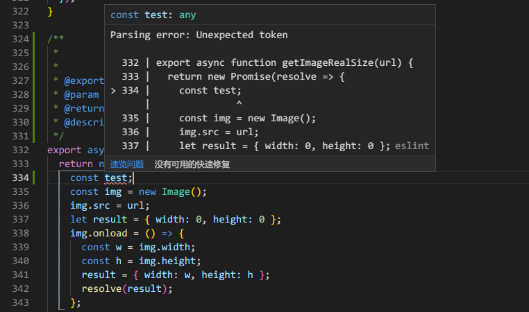
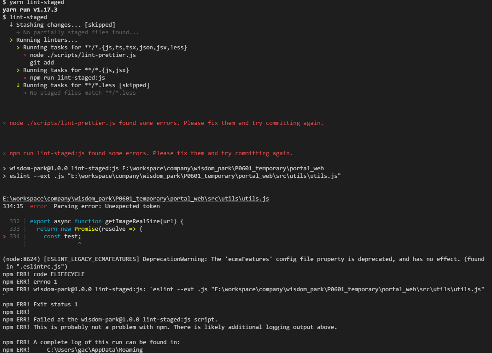
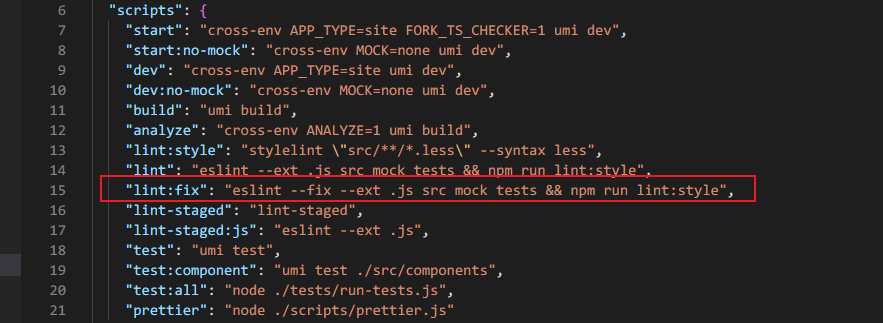
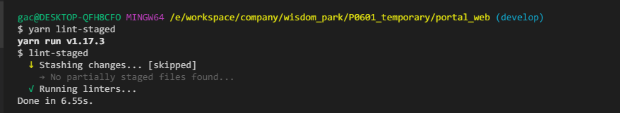

# JavaScript Style Guide

项目中采用的广受业界好评的 Airbnb 版规范。

- [English](https://github.com/airbnb/javascript)
- [中文版](https://github.com/BingKui/javascript-zh)

当然，有了规范，下一步就是如何去遵守，遵循"人类是懒惰的"原则，随着时间推移，开发者可能逐渐将规范抛之脑后，加之新加入的小伙伴需要快速的融入团队，不可能逐个过一遍规范，更多的是在日常开发中有个提示，所以我们就需要检测与修复工具的帮助。

## 相关工具

- [ESLint](http://eslint.cn/) - 可组装的 JavaScript 和 JSX 检查工具，支持配置不同规范，例如：Airbnb
- [Prettier](https://prettier.io/) - 一个代码格式化器，支持多种格式的转换。
- [husky](https://github.com/typicode/husky) - 🐶 Git hooks made easy，帮助在 git commit 时，触发 pre-commit 钩子，执行 ESLint 规则检测，以及配合 Prettier 进行修复

## 旧项目使用

## 新项目使用

新项目一般都会采用一些业界成熟的脚手架，比如 [UmiJS](https://umijs.org/zh/)、[Next](https://nextjs.org/) 等，都自带以上完善的代码检测流程，只需要选择合适的规范插件即可，故不多做赘述。

效果如下：

## ESLint+prettier+husky 标准编程规范自动化验证

> 当我们编写不规范代码时，通过编辑器如 VSCode,即可直观的看到 ESLint 错误提示

> 此时如果我们直接 commit 代码，检测工具会通过 kusky 触发 git pre-commit hook，执行 ESLint 规范检测，如果不通过，将会提示出不规范的地方以及相应位置。

> 此时我们可以选择`npm run lint:fix` 或者`yarn lint:fix` 来用 prettier 自动进行修复，当然遇到一些无法修复的，还是需要我们手动修复。

> 当错误修复完成后，再运行检测命令`npm run lint-staged` 或者`yarn lint-staged`

代码检测通过，此时便可以正常 commit。
